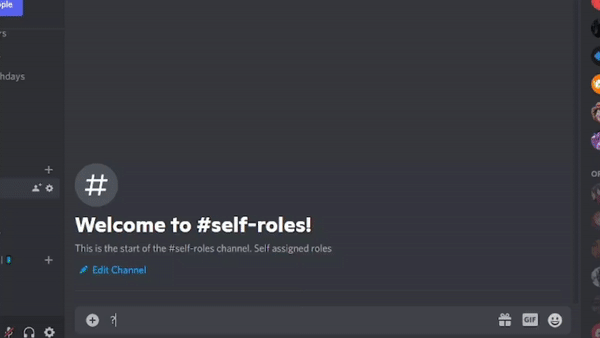

# Ajds Bots
[](https://github.com/Lynxx21/Ajdsbots-reverse.git)


#


## Language


## Example Future



#### Requirements
* Node Js Stable Version
* Text Editor

## Steps
* Changes Token , Prefix Of The Bot In config.js 
* Change Owner Id In Owner.json


## Author
* Original Author: `Manav Garg`
* Remake Author : `Lynxx21`


#### Features
| Features | Status | Note
|---|---|---|
| `😎 Images ` | `✅` | Stable |
| `😹 Fun ` | `✅` | Stable |
| `🤖 Moderation` | `✅` | Stable |
| `👾 Smart Bot` | `✅` | Stable |
| `⛔️ NSFW` | `✅` | Warning Dont Use This commands |
| `🎉 Giveaway` | `✅` | Stable |
| `👩🏻‍🏭 Backups Discord Server` |  `✅` | Stable |
| `🧲 Suggest` |  `✅` | Stable |
| `®️ Other Features` |  `✅` | Stable |

### END STEP
```diff
+ npm install
- node index.js
```


